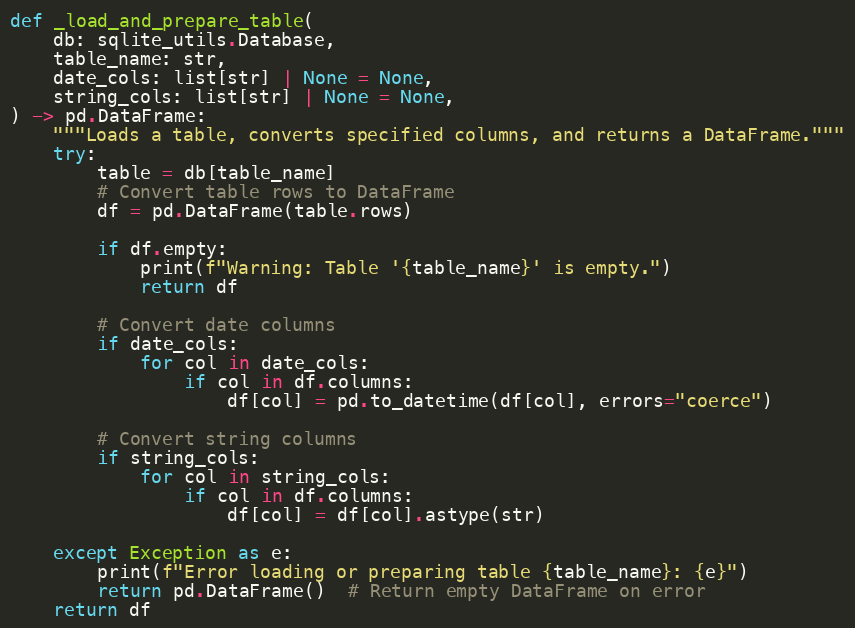
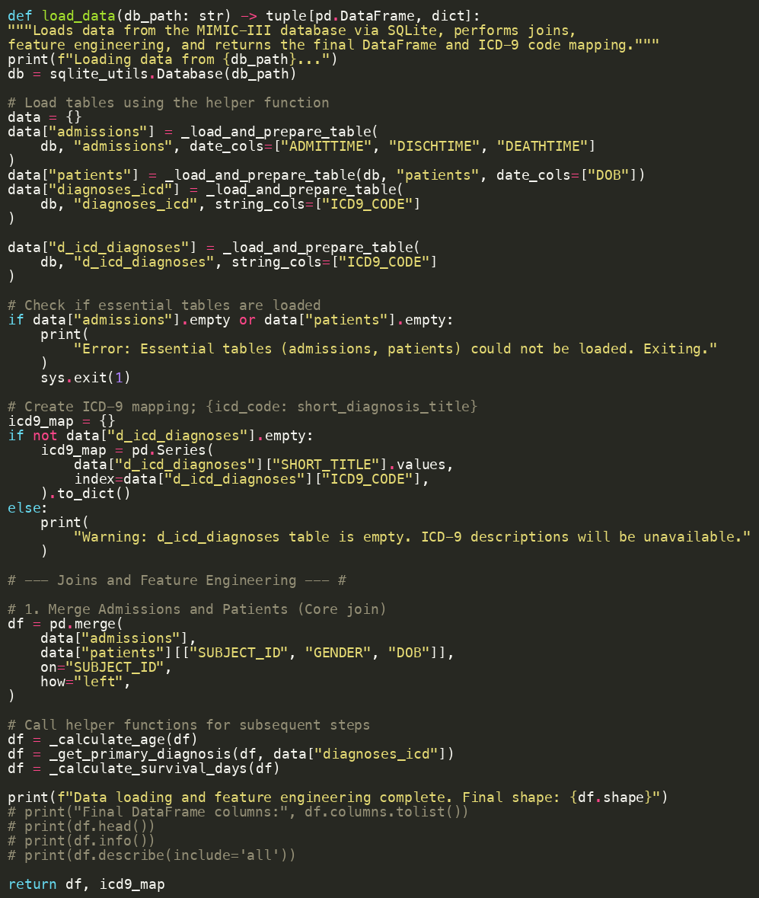
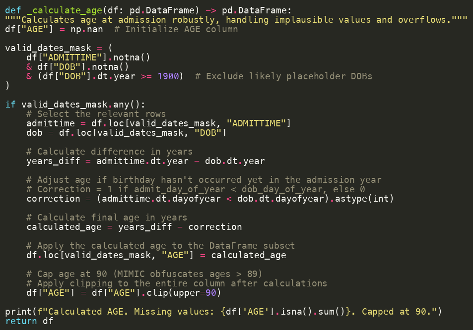
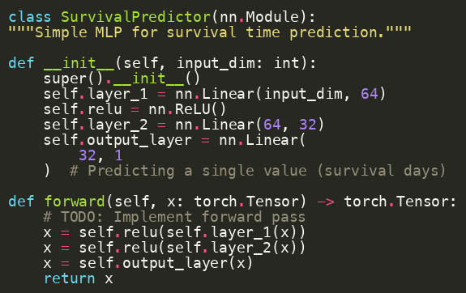
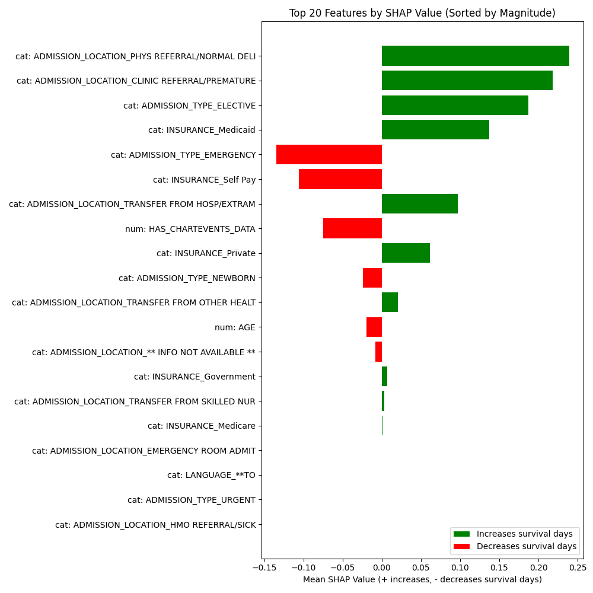

autoscale: true
theme: next, 1
code-language: Python

## AI In Healthcare, ML/DL Tutorial
### [Evan Jones](mailto:evan_jones@utexas.edu), UT ID:  `ej8387`
Assignment source at: 
[`https://github.com/etjones/aihc_hw6_mldl_ej8387`](https://github.com/etjones/aihc_hw6_mldl_ej8387)

--- 

# Overview: Who will make it out of the ICU?
 
**Every hospital admission carries some risk.**
 
**What factors, at admission, predict  patient survival best?**

---

# Load Data From SQLite Database as Pandas Dataframes
We use a SQLite database containing Mimic-III data, built with the [import.py](https://github.com/MIT-LCP/mimic-code/blob/main/mimic-iii/buildmimic/sqlite/import.py) script from the [`mimic-code`](https://github.com/MIT-LCP/mimic-code) repository.

---

# Combine `admissions`, `patients`, and `diagnoses` tables 

We're interested in data available immediately at intake: patient demographics and diagnoses. 
We include human-readable `SHORT_TITLE` columns for diagnosis codes.

---

# Calculate age, making up for Mimic-3 Obfuscation

To anonymize patients, patient DOBs and admission days are shifted by random amounts. 
We generate a synthetic column, `AGE` from the obfuscated data.

---

# Define `SurvivalPredictor` model
We use a simple two-layer Linear/ReLU PyTorch model to train on our dataset. 

More complex models like convolutional neural networks or transformers wouldn't be very helpful with  the slim set of data available at intake time.

--- 

# Train model

Even a simple Linear/ReLU deep learning model learns the important features.
 
One benefit of this approach is that we don't have to know which features are important; gradient descent identifies significant features on its own.

--- 

# Identify influential features with Permutation Importance

For each feature, randomly change values several times, and record which changes alter the loss (mean-squared error) most. 

This is a sizeable function. See `patient_survival.calulate_feature_importance()` for details.

---

# Permutation Importance weaknesses

- Permutation Importance analysis **doesn't** tell us which direction a change in a given feature changes the predictive power of the model. We see both `GENDER_M` and `GENDER_F` in the chart of feature importance. What does this mean?
- Likewise, does `RELIGION_PROTESTANT_QUAKER` make a patient more or less likely to survive? 
I suspect the answer is that Quakerism is a proxy for high socioeconomic status, 
so quakers tend to have better health outcomes, but I haven't identified this conclusively.
- `RELIGION_CATHOLIC` is also an influential feature, but I suspect in the opposite 
direction, correlated with under-resourced Latin American immigrants. 

- This phenomenon calls for some more easily interpretable analysis.

--- 

# Calculate importance with SHAP values

SHAP values tell us about magnitude of importance, but also *direction*.

Some features predict longer survival. Others predict shorter.

It's important to know which is which!

**Anomolous behavior**
- No diagnosis codes appear as significant SHAP features. I haven't isolated why they appear in the Permutation Importance analysis but not in the SHAP values.
  
---

# Which features predict best?

**Notable risks:**
- Septicemia
- Brain bleeds / Strokes
- Advanced cancer
- Emergency admission
- No insurance
 
**Anomalous results:**
- Married status 
  - (Correlates with age?)
- Catholic or Quaker 
  - (Data artifact? How many quakers *are* there?)

---

# Conclusion
- I trained a Linear/ReLU deep network on patient data available immediately at intake, predicting length of survival for patients who died at the hospital.

- I predict length of survival relatively accurately.

- I used two methods, Permutation Importance and SHAP Values, to identify important predictive features.

- I was unable to resolve the different results of my importance analyses.