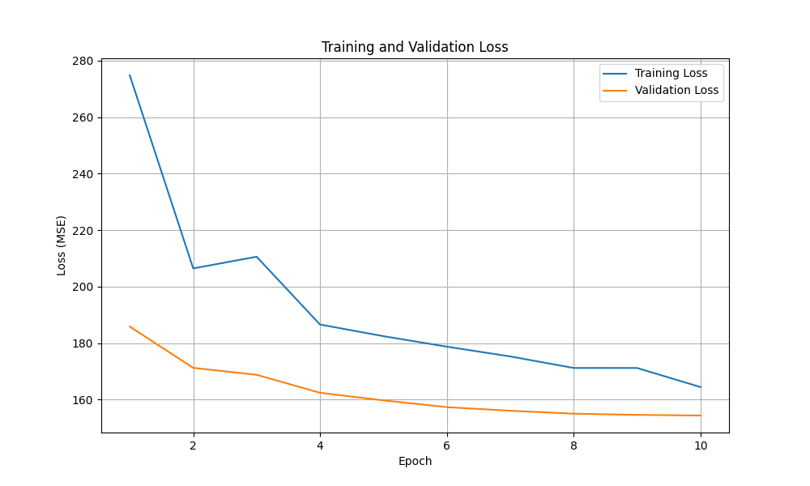
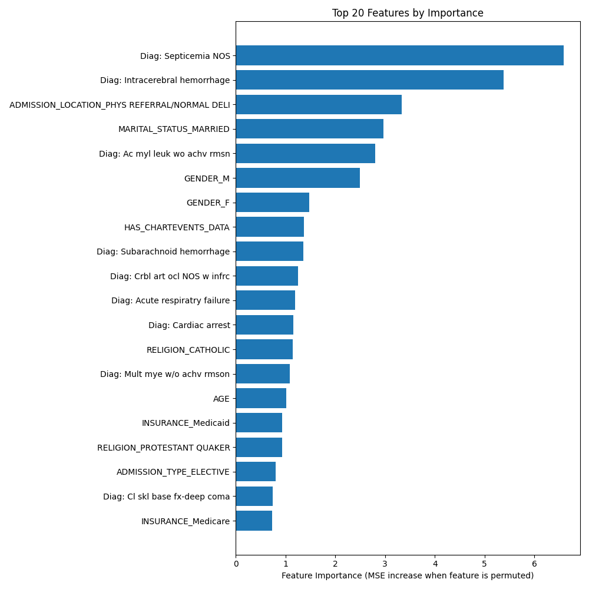

autoscale: true
theme: next, 1
code-language: Python

## AI In Healthcare, Homework 6: ML/DL Tutorial
### [Evan Jones](mailto:evan_jones@utexas.edu), UT ID:  `ej8387`

--- 

# Overview: Who will make it out of the ICU?
Every hospital admission carries some risk. 
What factors, at admission, predict  patient death best?

---

# Load Data From SQLite Database as Pandas Dataframes

---

# Combine tables so all columns are available

---

# Define Models

--- 

# Train Models

--- 

# Compare Results

Notable risks:
- Septicemia
- Brain bleeds
- Advanced cancer

---

# Conclusion
